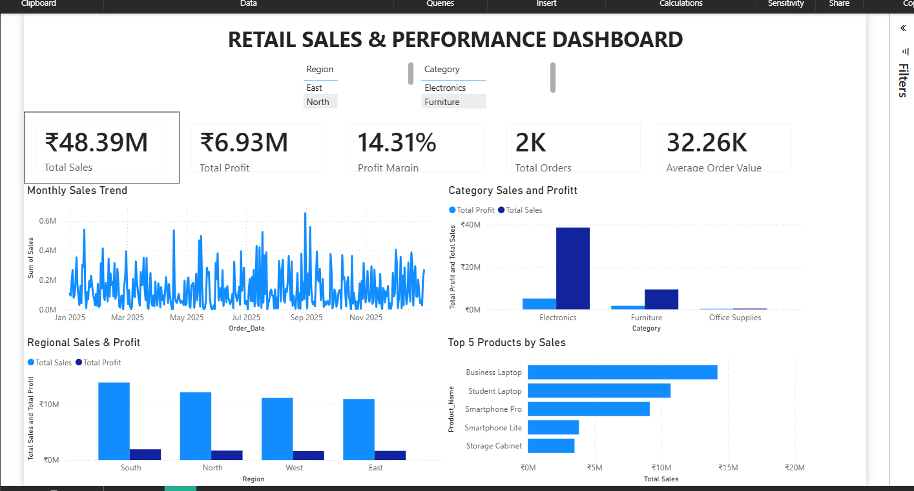

# 📊 Retail Sales & Performance Analytics Dashboard

## 📌 Project Overview

An end-to-end retail sales and profitability analytics project built using **Excel, SQL, and Power BI**.

The project analyzes retail performance across **time, product, category, and region**, and presents the results through an interactive Power BI dashboard with KPI cards, slicers, and visual analysis.

---
## 📊 Power BI Dashboard




## 🎯 Business Objectives

- Analyze overall sales and profitability performance
- Identify high-performing products and categories
- Compare sales and profit across different regions
- Analyze sales trends over time
- Track key business performance indicators
- Build an interactive dashboard for business decision-making

---

## 🛠️ Tools & Technologies

- **Microsoft Excel** – Data preparation and analysis
- **Power BI** – Data visualization and interactive dashboard
- **DAX** – KPI and measure calculations

---

## 📈 Key KPIs

The dashboard tracks:

- **Total Sales:** ₹48.39M
- **Total Profit:** ₹6.93M
- **Profit Margin:** 14.31%
- **Total Orders:** 2K
- **Average Order Value:** 32.26K

---

## 📊 Dashboard Features

### Monthly Sales Trend
Analyzes sales performance over time and highlights fluctuations and major sales spikes throughout the year.

### Category Sales & Profit
Compares sales and profit performance across:
- Electronics
- Furniture
- Office Supplies

### Regional Sales & Profit
Compares sales and profitability across:
- South
- North
- West
- East

### Top Products by Sales
Highlights the highest-selling products, including:
- Business Laptop
- Student Laptop
- Smartphone Pro
- Smartphone Lite
- Storage Cabinet

### Interactive Filters
The dashboard includes filters for:
- Region
- Category

These allow users to dynamically explore the data.

---

## 💡 Key Insights

- **Electronics** is the strongest-performing category by sales.
- The **South region** generates the highest sales among the regions analyzed.
- **Business Laptop** is the top-selling product in the dashboard.
- Sales performance varies significantly throughout the year, with several noticeable peaks.
- Overall profitability stands at approximately **14.31%**.

---

## 📁 Project Structure

```text
retail-sales-analysis/
│
├── Excel/
│   └── myproject.xlsx
│
├── PowerBI/
│   └── priyam project.pbix
│
└── README.md
